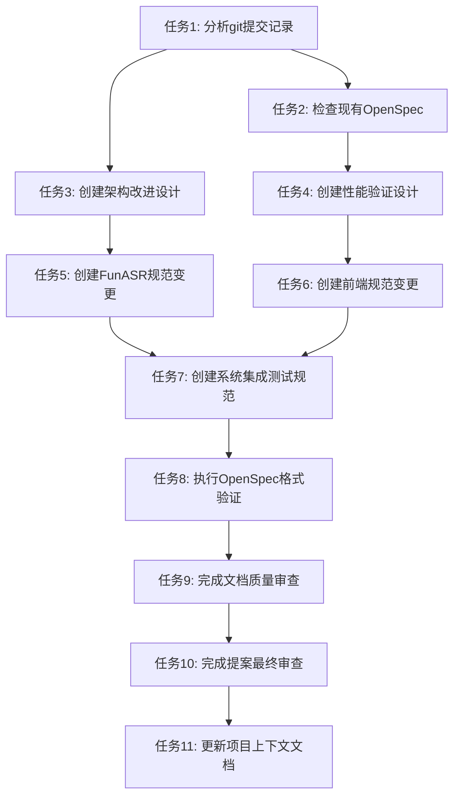

# 记录FunASR修复和前端优化 - 任务清单

## 任务列表

### 阶段1：项目分析和信息收集

- [ ] **任务1**：分析最近的git提交记录和技术变更
  - 验证所有修改的文件和内容
  - 识别关键的技术决策和架构改进
  - 收集性能指标和验证结果
  - **验证**：提交记录分析完成，关键信息收集完整

- [ ] **任务2**：检查现有OpenSpec结构和规范
  - 查看现有项目文档和变更记录
  - 确认当前的项目能力和规范结构
  - 识别需要更新的部分
  - **验证**：现有文档结构理解，更新范围明确

### 阶段2：创建设计文档

- [ ] **任务3**：创建架构改进设计文档
  - 记录前端CSS架构优化决策
  - 说明CDN移除的技术考虑和收益
  - 描述模型路径解析优化方案
  - **验证**：设计文档完整，技术决策清晰

- [ ] **任务4**：创建性能验证设计文档
  - 记录系统性能基准和测试方法
  - 描述实时语音识别性能指标
  - 说明并发连接和资源使用情况
  - **验证**：性能文档完整，基准数据准确

### 阶段3：创建规范变更

- [ ] **任务5**：创建FunASR语音识别服务规范变更
  - 记录模型加载和路径管理改进
  - 添加错误处理和日志记录要求
  - 更新性能和可靠性要求
  - **验证**：规范变更符合格式，需求场景完整

- [ ] **任务6**：创建前端用户界面规范变更
  - 记录CSS架构优化要求
  - 添加性能和离线支持要求
  - 更新UI组件和测试要求
  - **验证**：前端规范变更完整，测试要求明确

- [ ] **任务7**：创建系统集成测试规范变更
  - 记录端到端测试要求
  - 添加性能基准测试规范
  - 更新并发连接和稳定性测试
  - **验证**：测试规范完整，验证方法可操作

### 阶段4：验证和审查

- [ ] **任务8**：执行OpenSpec格式验证
  - 运行严格模式验证所有规范
  - 修复格式和内容问题
  - 确保所有要求都有场景描述
  - **验证**：openspec validate通过，无错误和警告

- [ ] **任务9**：完成文档质量审查
  - 检查所有文档的完整性和准确性
  - 验证任务分解的合理性和可跟踪性
  - 确认设计文档的完整性和逻辑性
  - **验证**：文档质量达标，内容准确完整

### 阶段5：完成和发布

- [ ] **任务10**：完成提案最终审查
  - 检查提案目标的实现情况
  - 验证所有任务完成状态
  - 确认变更范围和影响评估
  - **验证**：提案完整，目标达成

- [ ] **任务11**：更新项目上下文文档
  - 根据最新的架构改进更新project.md
  - 添加新的技术栈和约束信息
  - 更新项目状态和里程碑
  - **验证**：项目文档更新，信息准确

## 任务依赖关系

## 并行执行机会

- **任务1**和**任务2**可以并行执行
- **任务3**和**任务4**可以并行执行
- **任务5**、**任务6**、**任务7**可以部分并行执行

## 验证标准

### 完成性标准
- 所有任务状态为已完成
- 所有文档创建和更新完成
- 验证测试全部通过

### 质量标准
- OpenSpec格式验证无错误
- 文档内容准确完整
- 技术决策清晰可理解
- 任务分解合理可跟踪